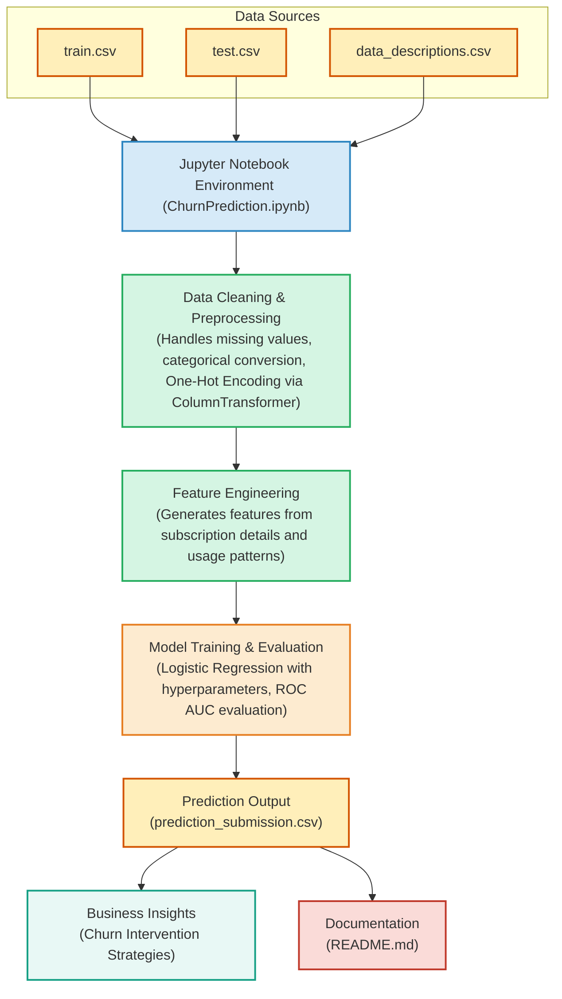

# **Coursera - Data Science Challenge - Customer Churn Prediction**





## **Project Overview**  
This project focuses on predicting customer churn for a video streaming service using machine learning. I built a **Logistic Regression model** with **feature engineering and pipeline-based preprocessing**, achieving a **ROC AUC score of 75.1%**. The goal is to identify high-risk churn customers early, enabling the business to take proactive retention measures and reduce revenue loss.


---

## **Dataset Details**  
- **Training Data:** 243,787 records  
- **Test Data:** 104,480 records  
- **Features:** Subscription details, payment methods, content preferences, usage behavior, and demographics  
- **Target Variable:** `Churn` (Binary: 1 = Churn, 0 = Retained)  

---

## **Approach & Methodology**  

### **1. Data Cleaning & Preprocessing**
- Handled missing values and ensured data consistency.
- Converted binary categorical variables (`Yes/No`) into numeric form.
- Applied **One-Hot Encoding** to categorical features using `ColumnTransformer`.

### **2. Feature Engineering**
- Engineered relevant features from subscription type, user activity, and preferences.
- Created new insights from existing attributes to improve model performance.

### **3. Model Development**
- Used **Logistic Regression** within a **pipeline** to streamline preprocessing and training.
- Optimized hyperparameters (`max_iter = 1000`, `C=1.0`, `solver=lbfgs`).
- Evaluated model performance using **ROC AUC score**.

### **4. Results & Business Impact**
- Achieved a **75.1% ROC AUC score**.
- Provided insights to help the business implement **targeted retention strategies** and reduce customer churn.

---

### **How the Business Problem is Solved with Logistic Regression**  

The core business problem was to **identify customers at high risk of churning** from the video streaming service. By using a **Logistic Regression model with feature engineering and preprocessing**, we achieved the following key outcomes:

 **Early Churn Prediction**:  
- The model predicts **churn likelihood for each customer**, allowing proactive retention strategies.  
- With a **75.1% ROC AUC score**, it effectively differentiates between customers likely to churn vs. stay.  

 **Data-Driven Decision Making**:  
- The model provides insights into **which customer segments** (e.g., payment methods, subscription types, content preferences) are more likely to churn.  
- This helps in **tailoring marketing efforts** and **offering personalized retention incentives**.  

 **Cost Reduction & Revenue Growth**:  
- **Preemptive retention strategies** (e.g., discounts, content recommendations) can be targeted at high-risk users.  
- Preventing churn directly translates to **higher customer lifetime value (CLV)** and **reduced acquisition costs**.  

 **Scalability & Automation**:  
- The pipeline-based model can **easily be updated** with new data, making it scalable for future use.  
- It can be deployed as an **API or integrated into a CRM system** for **real-time churn prediction**.  

### **Conclusion**  
This solution aligns with the business objective by **enabling strategic interventions** before customers churn, leading to **higher retention, improved profitability, and sustained user engagement**. 

---

## **Tools & Technologies Used**
- **Programming Language:** Python  
- **Libraries:** Pandas, NumPy, Scikit-learn  
- **Machine Learning:** Logistic Regression, OneHotEncoder, ColumnTransformer  
- **Development Environment:** Jupyter Notebook  

---

## **Link to Coursera Data Science Challenge**
For more details and to view the challenge notebook, visit the following link:  
[Coursera Data Science Challenge - Churn Prediction](https://hub.labs.coursera.org:443/connect/sharedzfcxmnxr?forceRefresh=false&path=%2Fnotebooks%2FChurnPrediction.ipynb&isLabVersioning=file-prep)

---
## **How to Run the Project**
1. Clone the repository:  
   ```bash
   git clone https://github.com/your-github-username/churn-prediction.git
   cd churn-prediction
   ```
2. Install dependencies:  
   ```bash
   pip install -r requirements.txt
   ```
3. Run the Jupyter Notebook to train the model and generate predictions.  

---
